# Customer Segmentation and Analysis

## Segment Analysis

1.  Customer segments after reducing the dimension of the data looks like this:)
   
   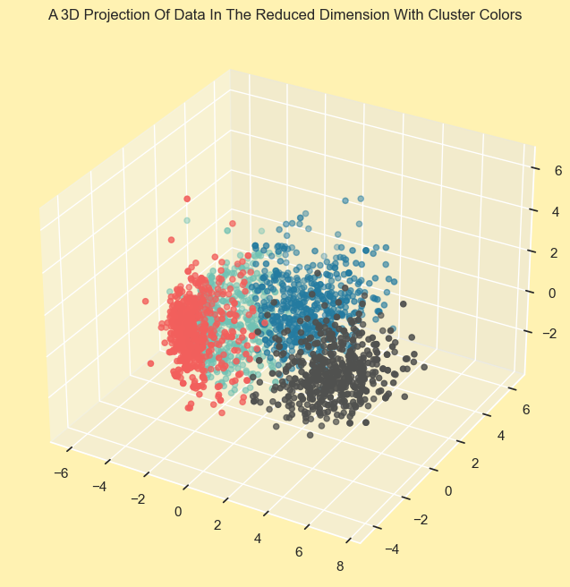

2. The segments are distributed fairly. From this diagram it is evident.
   
   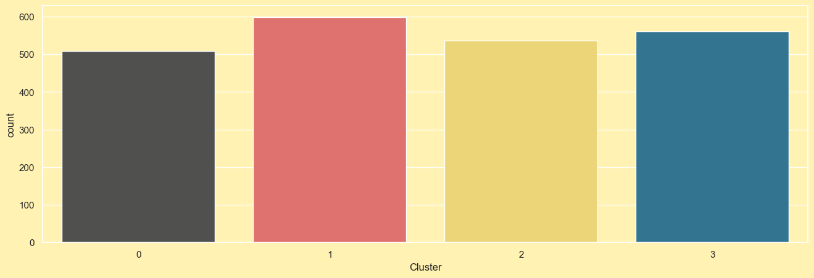

3. By plotting a scatter plot between Income and Spending power of the customers, we can see the customer segments and their properties that align with their income.
   
   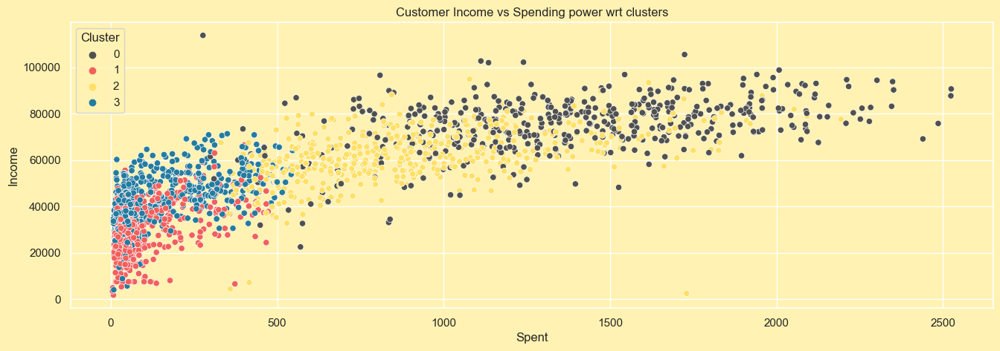
   
   **Customer Segments and their purchasing behaviour depending on their `Income`**
   
   - Cluster 0: High Income and High Spending
   - Cluster 1: Low Income and Low Spending
   - Cluster 2: High Income and Average Spending
   - Cluster 3: High Income and Low Spending

4. Customer segment distrubution for their spending power represented by boxplot is as follows.
   
   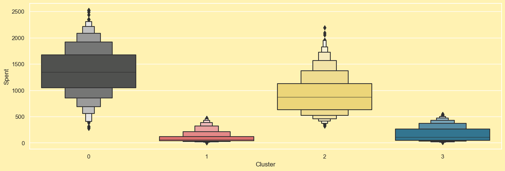
   
   **Insights**
   
   - Cluster 0 and Cluster 2 have high spending power and they are our main source of customers.
   - Cluster 1 and cluster 3 seems to spend a lot less amount on purchasing our products but cluster 3 has many customers who spend a bit more than people from cluster 1.

5. Customer segments and their interaction with promotional contents.
   
   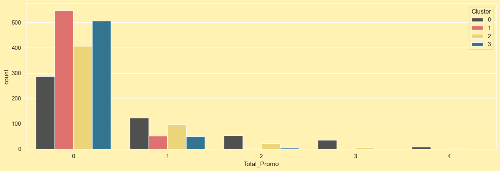
   
   **Insights**
   
   - Promotions have not been much popular.
   - We can say that promotions are not particularly working and needs improvements.

6. Number of deals taken by customers from each customer segment.
   
   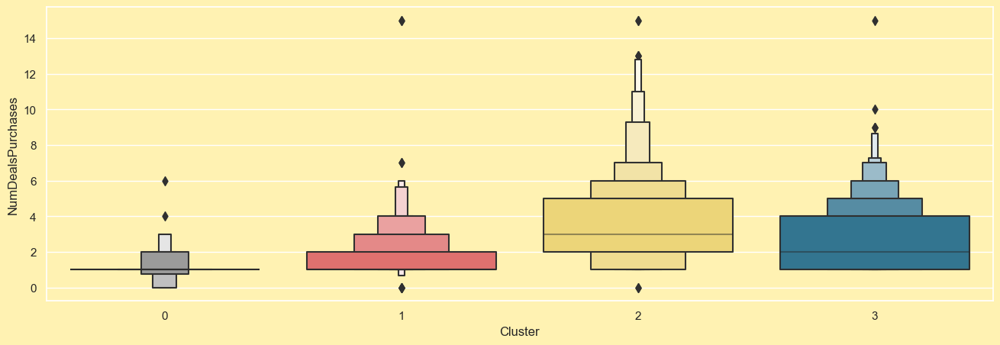
   
   **Insight**
   
   - Cluster 2 and cluster 3 are specially active when it comes to purchasing deals. There are a lot of deals purchases from cluster 2 specially and next is cluster 3.
   - Although comparatively less, cluster 2 also has higher number of deals that are purchased.

7. Customer profiles based on their behaviour and personality.
   
   **Customer profiles**
   
   1. *Cluster 0*:
      
      - Customers of this cluster are definitely no parents.
      - They have atmost 2 family members.
      - Some are living single and some are living with their spouse.
   
   2. *Cluster 1*:
      
      - Most Customers of this cluster are parents and very few are not.
      - They have atmost 3 people in their family.
      - They are mostly young people atmost in their early 40s.
      - They don't have any teen at their home.
   
   3. *CLuster 2*:
      
      - Most customers of this cluster are parents.
      - Their family size is atleast 2 and atmost 4.
      - Most of them have 1 children in their home.
      - They mostly have teens not kids.
      - They have been our customer for a longer duration.
   
   4. *Cluster 3*:
      
      - Most customers of this cluster are not parents.
      - Their family size is atleast 2 and atmost 5.
      - They have atleast 1 children and atmost 3 children.
      - Most of the children are teens.
      - They have been our customer for shorter period of time.
   
   This results are taken from the following figures.
   
   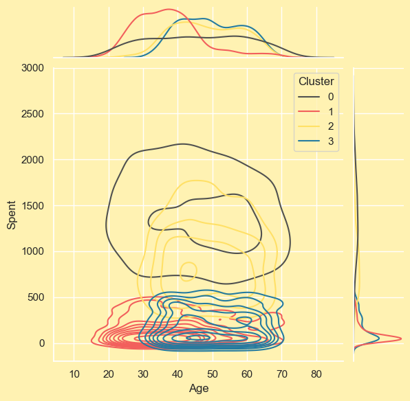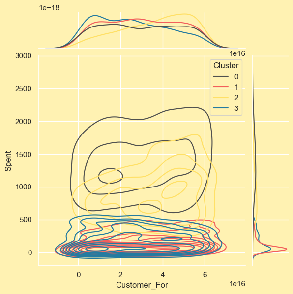
   
   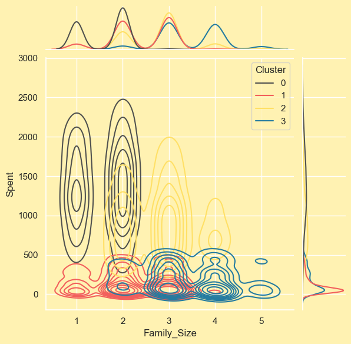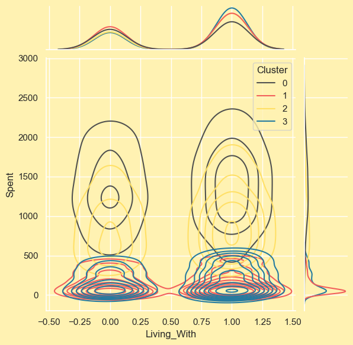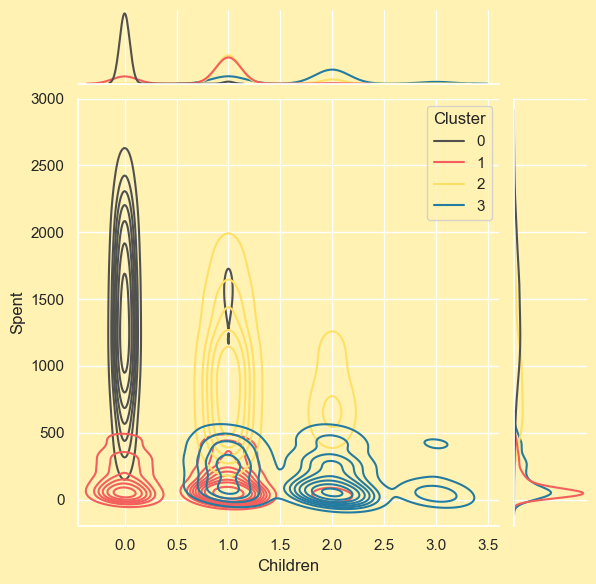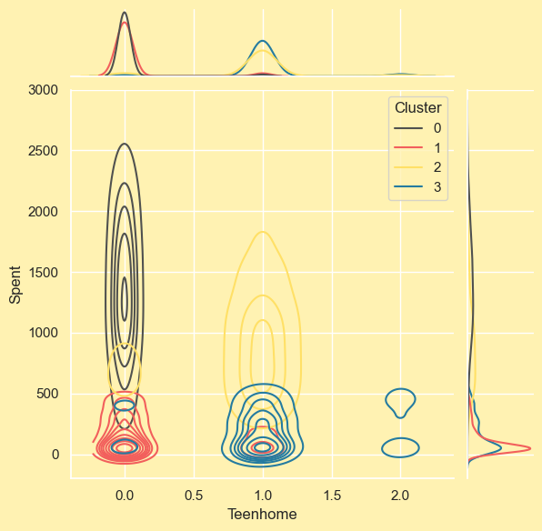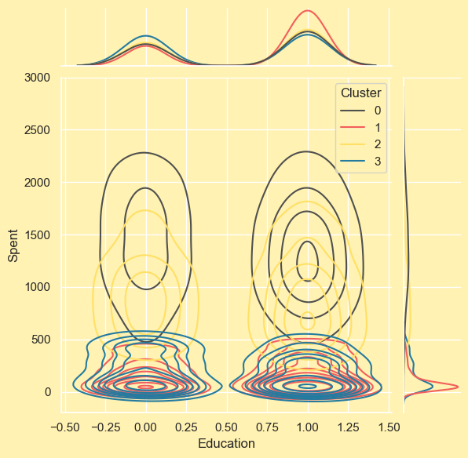

## Dataset

Link: [Here](https://www.kaggle.com/datasets/imakash3011/customer-personality-analysis).

## About the project

Customer Personality Analysis is a detailed analysis of a company’s ideal customers. It helps a business to better understand its customers and makes it easier for them to modify products according to the specific needs, behaviors and concerns of different types of customers.

Customer personality analysis helps a business to modify its product based on its target customers from different types of customer segments. For example, instead of spending money to market a new product to every customer in the company’s database, a company can analyze which customer segment is most likely to buy the product and then market the product only on that particular segment.

## About the dataset

Attributes

**People**

- ID: Customer's unique identifier
- Year_Birth: Customer's birth year
- Education: Customer's education level
- Marital_Status: Customer's marital status
- Income: Customer's yearly household income
- Kidhome: Number of children in customer's household
- Teenhome: Number of teenagers in customer's household
- Dt_Customer: Date of customer's enrollment with the company
- Recency: Number of days since customer's last purchase
- Complain: 1 if the customer complained in the last 2 years, 0 otherwise

**Products**

- MntWines: Amount spent on wine in last 2 years
- MntFruits: Amount spent on fruits in last 2 years
- MntMeatProducts: Amount spent on meat in last 2 years
- MntFishProducts: Amount spent on fish in last 2 years
- MntSweetProducts: Amount spent on sweets in last 2 years
- MntGoldProds: Amount spent on gold in last 2 years

**Promotion**

- NumDealsPurchases: Number of purchases made with a discount
- AcceptedCmp1: 1 if customer accepted the offer in the 1st campaign, 0 otherwise
- AcceptedCmp2: 1 if customer accepted the offer in the 2nd campaign, 0 otherwise
- AcceptedCmp3: 1 if customer accepted the offer in the 3rd campaign, 0 otherwise
- AcceptedCmp4: 1 if customer accepted the offer in the 4th campaign, 0 otherwise
- AcceptedCmp5: 1 if customer accepted the offer in the 5th campaign, 0 otherwise
- Response: 1 if customer accepted the offer in the last campaign, 0 otherwise

**Place**

- NumWebPurchases: Number of purchases made through the company’s website
- NumCatalogPurchases: Number of purchases made using a catalogue
- NumStorePurchases: Number of purchases made directly in stores
- NumWebVisitsMonth: Number of visits to company’s website in the last month

## Business Objectives

1. **Customer Profiling**
- Problem: Understand the demographics and characteristics of different customer segments.
- Solution: Use demographic features like age, education, marital status, and income to create customer profiles. This helps in targeted marketing and product customization for different segments.
2. **Purchase Behavior Analysis**
- Problem: Analyze what products customers are buying and how much they are spending.
- Solution: Utilize features like MntWines, MntFruits, etc., to analyze spending patterns. Identify which products are popular among specific customer segments and optimize stock and promotions accordingly.
3. **Campaign Effectiveness**
- Problem: Evaluate the effectiveness of past marketing campaigns.
- Solution: Use AcceptedCmp1 to AcceptedCmp5 and Response features to analyze campaign acceptance rates among different segments. Identify which campaigns were successful for specific customer groups and tailor future campaigns accordingly.
4. **Customer Engagement**
- Problem: Measure customer engagement with the company’s website and promotions.
- Solution: Utilize features like NumWebVisitsMonth, NumWebPurchases, and NumCatalogPurchases to understand online behavior. Identify segments with high online engagement and target them with online promotions.
5. **Customer Retention**
- Problem: Identify factors affecting customer retention and loyalty.
- Solution: Analyze Recency (number of days since last purchase) and Complain feature to understand customer satisfaction and loyalty. Identify trends among customers who complained and work on improving their experience.
6. **Channel Optimization**
- Problem: Optimize sales channels (website, stores, catalog) based on customer preferences.
- Solution: Use features like NumWebPurchases, NumCatalogPurchases, and NumStorePurchases to identify preferred buying channels among different segments. Optimize inventory and marketing strategies for each channel.
7. **Promotion Strategy**
- Problem: Determine which promotions are most effective for different customer segments.
- Solution: Analyze NumDealsPurchases and campaign acceptance features to identify the types of promotions that drive sales for specific customer groups. Adjust promotions based on segment preferences.
8. **Customer Journey Mapping**
- Problem: Understand the customer journey from website visits to purchases.
- Solution: Utilize features related to web visits, online purchases, and in-store purchases to map the customer journey. Identify drop-off points and optimize user experience to increase conversions.
9. **Upselling and Cross-selling**
- Problem: Identify opportunities for upselling and cross-selling products.
- Solution: Analyze purchase patterns across different product categories. Identify products often bought together (cross-selling) and products that can be upgraded (upselling) based on customer segments.
10. **Customer Segmentation Refinement**
- Problem: Refine existing customer segments for targeted marketing efforts.
- Solution: Utilize clustering algorithms to identify natural customer segments based on various features. Refine segments based on purchase behavior, responsiveness to promotions, and other relevant criteria.

## Sample works by other people

- https://www.kaggle.com/code/imakash3011/customer-analysis-eda-report-clustering
- https://www.kaggle.com/code/alisultanov/clustering-customer-personality-analysis
- https://www.kaggle.com/code/sisharaneranjana/types-of-customers-and-what-they-need-r
- https://www.kaggle.com/code/sonalisingh1411/customer-personality-analysis-segmentation
- https://www.kaggle.com/code/karnikakapoor/customer-segmentation-clustering
